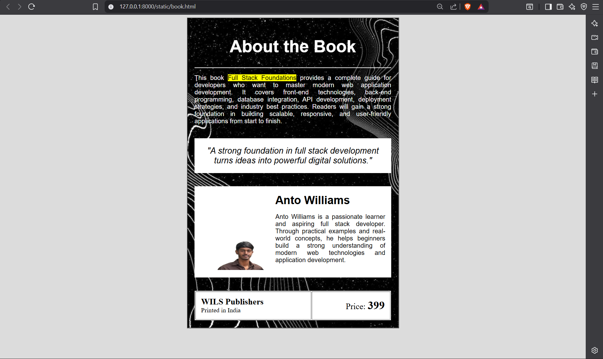

# Ex.05 Book Front Cover Page Design
## Date:
28-05-2026

## AIM:
To design a book front cover page using HTML and CSS.

## DESIGN STEPS:

### Step 1:
Create a Django Admin project.

### Step 2:
Create an app in the Django interface.

### Step 3:
Create a folder named 'static' in the app folder.

### Step 4:
Create a new HTML file in the static folder.

### Step 5:
Write the HTML code with relevant CSS properties.

### Step 6:
Choose the appropriate style and color scheme.

### Step 7:
Insert the images in their appropriate places.

### Step 8:
Publish the website in the LocalHost.

## PROGRAM:

```
<!DOCTYPE html>
<html>
<head>
    <title>Full Stack Foundations - Back Cover</title>
</head>

<body bgcolor="#dcdcdc">

<center>

<table border="1"
       cellpadding="20"
       cellspacing="0"
       width="600"
       height="700"
       background="bg.jpg">

    <tr>
        <td valign="top">

            <font color="white" face="Arial">
                <h1 align="center" style="font-size:48px;">
                    About the Book
                </h1>
            </font>

            <hr color="white">

            <font color="white" face="Arial" size="4">
                <p align="justify">
                    This book <mark>Full Stack Foundations</mark>
                    provides a complete guide for developers who want to
                    master modern web application development. It covers
                    front-end technologies, back-end programming,
                    database integration, API development, deployment
                    strategies, and industry best practices. Readers
                    will gain a strong foundation in building scalable,
                    responsive, and user-friendly applications from
                    start to finish.
                </p>
            </font>

            <br>

            <table width="100%" bgcolor="white" cellpadding="20">
                <tr>
                    <td>
                        <center>
                            <font color="black" face="Arial" size="5">
                                <i>
                                    "A strong foundation in full stack
                                    development turns ideas into powerful
                                    digital solutions."
                                </i>
                            </font>
                        </center>
                    </td>
                </tr>
            </table>

            <br><br>

            <table width="100%" bgcolor="white" cellpadding="15">
                <tr>

                    <td width="35%" align="center" valign="middle">
                        
                    </td>

                    <td width="65%" valign="middle">

                        <font color="black" face="Arial" size="6">
                            <b>Anto Williams</b>
                        </font>

                        <font color="black" face="Arial" size="4">
                            <p align="justify">
                                Anto Williams is a passionate learner and
                                aspiring full stack developer. Through
                                practical examples and real-world concepts,
                                he helps beginners build a strong
                                understanding of modern web technologies
                                and application development.
                            </p>
                        </font>

                    </td>

                </tr>
            </table>

            <br><br>

            <table width="100%" bgcolor="white" cellpadding="15" border="1">
                <tr>

                    <td>
                        <font color="black" size="5">
                            <b>WILS Publishers</b>
                        </font>
                        <br>
                        <font color="black" size="4">
                            Printed in India
                        </font>
                    </td>

                    <td align="right">
                        <font color="black" size="5">
                            Price:
                        </font>
                        <font color="black" size="6">
                            <b>399</b>
                        </font>
                    </td>

                </tr>
            </table>

        </td>
    </tr>

</table>

</center>

</body>
</html>
```

## OUTPUT:



## RESULT:
The program for designing book front cover page using HTML and CSS is completed successfully.
